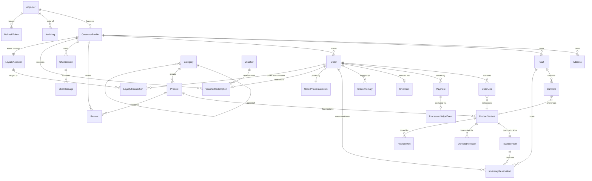

# Database Design

> Companion to `docs/PLAN.md` and `docs/REQUIREMENTS.md`. Single source of truth for the data model. If a column or relationship is here, it's authoritative; if it's only in code, it hasn't been merged yet.

## 1. Conventions

These apply globally. Per-table details below only call out exceptions.

- **Naming** — PascalCase tables (singular), PascalCase columns. PK is `Id`. FKs are `{Entity}Id`.
- **PK type** — `Guid` for business entities (`uniqueidentifier`). `int identity` for technical tables (`AuditLog`, `ProcessedStripeEvent`) for cheap clustering.
- **Time** — `datetime2(7)` always UTC. Application converts at the edge. Audit fields are present on every business entity: `CreatedAt`, `UpdatedAt`, `CreatedBy` (`nvarchar(64)`, holds user id or `"system"`), `UpdatedBy`.
- **Money** — `int` cents columns (`PriceCents`, `AmountCents`, `LineTotalCents`). Never `decimal` on hot tables; use `decimal(18,2)` only on aggregated report views.
- **JSON** — `nvarchar(max)` columns suffixed `Json` (`OptionsJson`, `RawPayloadJson`). EF Core `ValueConverter` to strongly-typed POCO.
- **Soft delete** — `IsDeleted bit not null default 0` on `Product`, `Category`, `Review` only. EF Core global query filter.
- **Concurrency** — `RowVersion rowversion` on `InventoryItem`, `Order`. EF Core `.IsRowVersion()`.
- **Indexes** — every FK indexed (EF Core default). Filter / sort columns indexed explicitly. Composite indexes ordered by selectivity, then typical filter usage.
- **Sequences** — `Seq_OrderNumber` (start `10001`, increment `1`) used as default value for `Order.OrderNumber`.
- **Schemas** — single `dbo` schema for MVP (no per-domain schema split).

Audit columns are NOT shown in the per-table contracts below; assume all business entities have them.

## 2. Entity-Relationship Diagram



**Cardinality recap**:
- Each `AppUser` *may* have one `CustomerProfile` (Staff / StoreManager / Administrator users have none).
- Each `ProductVariant` has exactly one `InventoryItem` (1:1).
- Each `Cart` has many `CartItem`s; on conversion, becomes one `Order`.
- `Order` to `Payment` is 1:N because partial refunds create additional `Payment` rows.
- `Order` to `Shipment` is currently 1:0..1 in MVP (single-shipment orders). Multi-shipment is a future extension.

## 3. Per-Table Contracts

Each table lists columns + key indexes + notes. EF Core configuration lives in `Retail.Api/Data/Configurations/{Entity}Configuration.cs` (three-tier single project — see `docs/CODING_STANDARDS.md` § Project Structure).

### 3.1 `AppUser` (ASP.NET Core Identity)

Inherits from `IdentityUser<Guid>`. Standard Identity columns (`UserName`, `NormalizedUserName`, `Email`, `NormalizedEmail`, `EmailConfirmed`, `PasswordHash`, `SecurityStamp`, `ConcurrencyStamp`, `PhoneNumber`, `LockoutEnd`, ...). Nothing custom.

Companion tables (also standard Identity): `AspNetRoles`, `AspNetUserRoles`, `AspNetUserClaims`, `AspNetUserLogins`, `AspNetUserTokens`, `AspNetRoleClaims`.

**Seeded roles** (Phase 0, updated 2026-06-06): `Customer`, `Staff`, `StoreManager`, `Administrator`. Role constants in `Common/Constants/Roles.cs`.

### 3.2 `CustomerProfile`

| Column | Type | Null | Default | Notes |
|---|---|:-:|---|---|
| Id | uniqueidentifier | N | newsequentialid() | PK |
| AppUserId | uniqueidentifier | N | — | FK → `AspNetUsers.Id`, unique |
| DisplayName | nvarchar(120) | N | — | |
| Phone | nvarchar(32) | Y | — | E.164 strings ideally |

**Indexes**: `UX_CustomerProfile_AppUserId` (unique).

### 3.3 `Address`

| Column | Type | Null | Default | Notes |
|---|---|:-:|---|---|
| Id | uniqueidentifier | N | newsequentialid() | PK |
| CustomerProfileId | uniqueidentifier | N | — | FK |
| Line1 | nvarchar(200) | N | — | |
| Line2 | nvarchar(200) | Y | — | |
| City | nvarchar(120) | N | — | |
| Region | nvarchar(120) | Y | — | State/province |
| PostalCode | nvarchar(20) | N | — | |
| Country | char(2) | N | — | ISO-3166 alpha-2 |
| IsDefaultShipping | bit | N | 0 | At most one true per profile, enforced in code |
| IsDefaultBilling | bit | N | 0 | At most one true per profile, enforced in code |

**Indexes**: `IX_Address_CustomerProfileId` (EF Core default).

### 3.4 `Category`

| Column | Type | Null | Default | Notes |
|---|---|:-:|---|---|
| Id | uniqueidentifier | N | newsequentialid() | PK |
| Slug | nvarchar(140) | N | — | URL-safe, unique |
| Name | nvarchar(140) | N | — | |
| ParentId | uniqueidentifier | Y | — | FK → `Category.Id`, max depth 3 (validated in code) |
| IsDeleted | bit | N | 0 | Soft delete + global filter |

**Indexes**: `UX_Category_Slug` (unique, filtered where IsDeleted=0), `IX_Category_ParentId`.

### 3.5 `Product`

| Column | Type | Null | Default | Notes |
|---|---|:-:|---|---|
| Id | uniqueidentifier | N | newsequentialid() | PK |
| Sku | nvarchar(64) | N | — | Unique (filtered where IsDeleted=0) |
| Slug | nvarchar(160) | N | — | URL-safe, unique (same filter) |
| Name | nvarchar(200) | N | — | |
| Description | nvarchar(max) | Y | — | |
| SeoTitle | nvarchar(200) | Y | — | |
| SeoDescription | nvarchar(400) | Y | — | |
| BrandName | nvarchar(120) | Y | — | |
| CategoryId | uniqueidentifier | N | — | FK → `Category.Id` |
| IsPublished | bit | N | 0 | |
| PrimaryImageBlobKey | nvarchar(260) | Y | — | Path in Blob container `product-images` |
| IsDeleted | bit | N | 0 | Soft delete + global filter |

**Indexes**:
- `UX_Product_Sku` (unique, filtered `IsDeleted=0`)
- `UX_Product_Slug` (unique, filtered `IsDeleted=0`)
- `IX_Product_CategoryId_IsPublished` (composite, supports storefront listing)

### 3.6 `ProductVariant`

| Column | Type | Null | Default | Notes |
|---|---|:-:|---|---|
| Id | uniqueidentifier | N | newsequentialid() | PK |
| ProductId | uniqueidentifier | N | — | FK |
| Sku | nvarchar(64) | N | — | Unique globally |
| OptionsJson | nvarchar(max) | N | '{}' | `{ "size": "M", "color": "red" }` via converter |
| PriceCents | int | N | — | ≥ 0 |
| CompareAtPriceCents | int | Y | — | For strikethrough display |
| IsActive | bit | N | 1 | |

**Indexes**: `UX_ProductVariant_Sku` (unique), `IX_ProductVariant_ProductId` (EF default).

### 3.7 `InventoryItem`

1:1 with `ProductVariant`. Hot table — concurrency-sensitive.

| Column | Type | Null | Default | Notes |
|---|---|:-:|---|---|
| Id | uniqueidentifier | N | newsequentialid() | PK |
| ProductVariantId | uniqueidentifier | N | — | FK, unique |
| OnHand | int | N | 0 | Physically in stock |
| Reserved | int | N | 0 | Held by active reservations |
| RowVersion | rowversion | N | (system) | Optimistic concurrency |

**Indexes**: `UX_InventoryItem_ProductVariantId` (unique).

**Computed at app level**: `Available = OnHand − Reserved`. NEVER stored.

**Update discipline**: only modified via:
- Reservation create/commit/release.
- Stripe payment commit / refund.
- Explicit admin adjustment (with reason → `AuditLog`).

Updates use `ExecuteUpdateAsync` with `Where(i => i.Id == id && i.RowVersion == originalRowVersion)`; 0 rows updated → throw `ConcurrencyException` → mapped to HTTP 409.

### 3.8 `InventoryReservation`

| Column | Type | Null | Default | Notes |
|---|---|:-:|---|---|
| Id | uniqueidentifier | N | newsequentialid() | PK |
| InventoryItemId | uniqueidentifier | N | — | FK |
| CartId | uniqueidentifier | Y | — | One of CartId / OrderId set |
| OrderId | uniqueidentifier | Y | — | |
| Quantity | int | N | — | > 0 |
| ExpiresAt | datetime2(7) | N | — | Sweeper releases past this |
| Status | tinyint | N | 1 | Enum: 1=Active, 2=Committed, 3=Released |

**Indexes**:
- `IX_InventoryReservation_InventoryItemId_Status`
- `IX_InventoryReservation_ExpiresAt_Status` (supports sweeper scan)
- `IX_InventoryReservation_CartId`
- `IX_InventoryReservation_OrderId`

### 3.9 `Cart`

| Column | Type | Null | Default | Notes |
|---|---|:-:|---|---|
| Id | uniqueidentifier | N | newsequentialid() | PK |
| CustomerProfileId | uniqueidentifier | Y | — | Null for anonymous |
| AnonymousKey | char(36) | Y | — | Set if no profile; GUID written to client cookie |
| Status | tinyint | N | 1 | Enum: 1=Open, 2=Abandoned, 3=Converted |
| ExpiresAt | datetime2(7) | N | — | DEFAULT GETUTCDATE() + 30 minutes (refreshed on update) |

**Indexes**:
- `IX_Cart_CustomerProfileId_Status`
- `IX_Cart_AnonymousKey_Status` (filtered `AnonymousKey IS NOT NULL`)
- `IX_Cart_ExpiresAt_Status` (supports sweeper)

### 3.10 `CartItem`

| Column | Type | Null | Default | Notes |
|---|---|:-:|---|---|
| Id | uniqueidentifier | N | newsequentialid() | PK |
| CartId | uniqueidentifier | N | — | FK |
| ProductVariantId | uniqueidentifier | N | — | FK |
| Quantity | int | N | — | > 0 |
| UnitPriceCentsSnapshot | int | N | — | Price at add-time |

**Indexes**: `IX_CartItem_CartId` (EF default), `UX_CartItem_CartId_ProductVariantId` (unique — prevents duplicates).

### 3.11 `Order`

| Column | Type | Null | Default | Notes |
|---|---|:-:|---|---|
| Id | uniqueidentifier | N | newsequentialid() | PK |
| OrderNumber | int | N | NEXT VALUE FOR Seq_OrderNumber | Human-readable (10001, 10002, ...) |
| CustomerProfileId | uniqueidentifier | N | — | FK |
| Status | tinyint | N | 1 | Enum: 1=Pending, 2=Paid, 3=Fulfilled, 4=Cancelled, 5=Refunded |
| SubtotalCents | int | N | — | |
| TaxCents | int | N | 0 | Flat 10% GST in MVP |
| ShippingCents | int | N | 0 | |
| TotalCents | int | N | — | = Subtotal + Tax + Shipping |
| ShippingAddressJson | nvarchar(max) | N | — | Snapshot at placement |
| BillingAddressJson | nvarchar(max) | N | — | Snapshot at placement |
| PlacedAt | datetime2(7) | N | — | UTC |
| RowVersion | rowversion | N | (system) | Optimistic concurrency |

**Indexes**:
- `UX_Order_OrderNumber` (unique)
- `IX_Order_CustomerProfileId_PlacedAt` (supports customer history)
- `IX_Order_Status_PlacedAt` (supports staff order queue)

### 3.12 `OrderLine`

| Column | Type | Null | Default | Notes |
|---|---|:-:|---|---|
| Id | uniqueidentifier | N | newsequentialid() | PK |
| OrderId | uniqueidentifier | N | — | FK |
| ProductVariantId | uniqueidentifier | N | — | FK |
| Quantity | int | N | — | > 0 |
| UnitPriceCents | int | N | — | At commit time |
| LineTotalCents | int | N | — | = UnitPriceCents × Quantity |
| SkuSnapshot | nvarchar(64) | N | — | For historical record even if variant changes |
| NameSnapshot | nvarchar(200) | N | — | |

**Indexes**: `IX_OrderLine_OrderId` (EF default), `IX_OrderLine_ProductVariantId` (supports per-variant sales aggregation).

### 3.13 `Payment`

| Column | Type | Null | Default | Notes |
|---|---|:-:|---|---|
| Id | uniqueidentifier | N | newsequentialid() | PK |
| OrderId | uniqueidentifier | N | — | FK |
| Provider | nvarchar(40) | N | 'stripe' | |
| StripeSessionId | nvarchar(120) | Y | — | Set after Checkout Session creation |
| StripePaymentIntentId | nvarchar(120) | Y | — | Set after payment success |
| AmountCents | int | N | — | Positive for charge, NEGATIVE for refund |
| Currency | char(3) | N | 'AUD' | ISO-4217 |
| Status | tinyint | N | 1 | Enum: 1=Created, 2=Succeeded, 3=Failed, 4=Refunded |
| RawPayloadJson | nvarchar(max) | Y | — | Last Stripe event body for audit |

**Indexes**: `IX_Payment_OrderId`, `IX_Payment_StripeSessionId` (filtered NOT NULL), `IX_Payment_StripePaymentIntentId` (filtered NOT NULL).

### 3.14 `Shipment`

| Column | Type | Null | Default | Notes |
|---|---|:-:|---|---|
| Id | uniqueidentifier | N | newsequentialid() | PK |
| OrderId | uniqueidentifier | N | — | FK, unique (1:0..1) |
| Carrier | nvarchar(60) | Y | — | Free-text in MVP |
| TrackingNumber | nvarchar(120) | Y | — | |
| Status | tinyint | N | 1 | Enum: 1=Pending, 2=Shipped, 3=Delivered |
| ShippedAt | datetime2(7) | Y | — | |
| DeliveredAt | datetime2(7) | Y | — | |

**Indexes**: `UX_Shipment_OrderId` (unique), `IX_Shipment_TrackingNumber` (filtered NOT NULL).

### 3.15 `Review`

| Column | Type | Null | Default | Notes |
|---|---|:-:|---|---|
| Id | uniqueidentifier | N | newsequentialid() | PK |
| ProductId | uniqueidentifier | N | — | FK |
| CustomerProfileId | uniqueidentifier | N | — | FK |
| Rating | tinyint | N | — | 1..5, check constraint |
| Body | nvarchar(4000) | N | — | |
| SentimentScore | decimal(4,3) | Y | — | (PositiveScore − NegativeScore), −1..1 |
| SentimentLabel | tinyint | Y | — | Enum: 1=Positive, 2=Neutral, 3=Negative, 4=Mixed |
| ProcessedAt | datetime2(7) | Y | — | When AI Language ran |
| IsDeleted | bit | N | 0 | Soft delete + global filter |

**Indexes**: `IX_Review_ProductId_CreatedAt`, `UX_Review_ProductId_CustomerProfileId` (one review per customer per product, unique filtered IsDeleted=0).

**Constraints**: `CHECK (Rating BETWEEN 1 AND 5)`.

### 3.16 `AuditLog`

| Column | Type | Null | Default | Notes |
|---|---|:-:|---|---|
| Id | bigint identity | N | — | PK, clustered (cheap append) |
| Actor | nvarchar(64) | N | — | user id (Guid string) or 'system' |
| Action | nvarchar(40) | N | — | 'Insert' / 'Update' / 'Delete' / domain-specific |
| EntityType | nvarchar(120) | N | — | CLR type name |
| EntityId | nvarchar(64) | N | — | Stringified PK |
| BeforeJson | nvarchar(max) | Y | — | Pre-mutation snapshot |
| AfterJson | nvarchar(max) | Y | — | Post-mutation snapshot |
| OccurredAt | datetime2(7) | N | sysutcdatetime() | |

**Indexes**:
- `IX_AuditLog_OccurredAt`
- `IX_AuditLog_EntityType_EntityId`
- `IX_AuditLog_Actor_OccurredAt`

### 3.17 `DemandForecast`

| Column | Type | Null | Default | Notes |
|---|---|:-:|---|---|
| Id | uniqueidentifier | N | newsequentialid() | PK |
| ProductVariantId | uniqueidentifier | N | — | FK |
| Horizon | smallint | N | 14 | Days |
| ForecastedQty | decimal(10,2) | N | — | |
| LowerBound | decimal(10,2) | N | — | 80% CI |
| UpperBound | decimal(10,2) | N | — | 80% CI |
| Confidence | decimal(4,3) | N | — | 0..1 |
| ModelVersion | nvarchar(40) | N | — | e.g. ISO date of training |
| GeneratedAt | datetime2(7) | N | sysutcdatetime() | |

**Indexes**: `IX_DemandForecast_ProductVariantId_GeneratedAt` (supports "latest forecast per variant").

### 3.18 `ReorderHint`

| Column | Type | Null | Default | Notes |
|---|---|:-:|---|---|
| Id | uniqueidentifier | N | newsequentialid() | PK |
| ProductVariantId | uniqueidentifier | N | — | FK |
| RecommendedOrderQty | int | N | — | |
| Reasoning | nvarchar(400) | N | — | Human-readable |
| GeneratedAt | datetime2(7) | N | sysutcdatetime() | |
| Dismissed | bit | N | 0 | |

**Indexes**: `IX_ReorderHint_ProductVariantId_Dismissed_RecommendedOrderQty` (supports admin "top reorder" tile).

### 3.19 `OrderAnomaly`

| Column | Type | Null | Default | Notes |
|---|---|:-:|---|---|
| Id | uniqueidentifier | N | newsequentialid() | PK |
| OrderId | uniqueidentifier | N | — | FK |
| Score | decimal(8,3) | N | — | Z-score or domain score |
| Reason | nvarchar(200) | N | — | "Order total 12.4 stdev above customer mean" |
| DetectedAt | datetime2(7) | N | sysutcdatetime() | |
| Acknowledged | bit | N | 0 | Staff or StoreManager clears |

**Indexes**: `IX_OrderAnomaly_OrderId`, `IX_OrderAnomaly_Acknowledged_DetectedAt` (supports risk queue).

### 3.20 `ChatSession`

| Column | Type | Null | Default | Notes |
|---|---|:-:|---|---|
| Id | uniqueidentifier | N | newsequentialid() | PK |
| CustomerProfileId | uniqueidentifier | Y | — | Null only if anonymous chat ever enabled |
| ConversationId | char(36) | N | — | GUID from client widget OR Copilot Studio |
| StartedAt | datetime2(7) | N | sysutcdatetime() | |
| LastMessageAt | datetime2(7) | N | sysutcdatetime() | Bumped on each turn |

**Indexes**: `UX_ChatSession_ConversationId` (unique), `IX_ChatSession_CustomerProfileId_LastMessageAt`.

### 3.21 `ChatMessage`

| Column | Type | Null | Default | Notes |
|---|---|:-:|---|---|
| Id | uniqueidentifier | N | newsequentialid() | PK |
| ChatSessionId | uniqueidentifier | N | — | FK |
| Role | tinyint | N | — | Enum: 1=User, 2=Assistant, 3=System, 4=Tool |
| Content | nvarchar(max) | N | — | |
| ToolName | nvarchar(80) | Y | — | If Role=Tool |
| ToolPayloadJson | nvarchar(max) | Y | — | Args or result |

**Indexes**: `IX_ChatMessage_ChatSessionId_CreatedAt`.

### 3.22 `ProcessedStripeEvent`

| Column | Type | Null | Default | Notes |
|---|---|:-:|---|---|
| Id | bigint identity | N | — | PK |
| StripeEventId | nvarchar(80) | N | — | Unique — webhook idempotency key |
| EventType | nvarchar(80) | N | — | e.g. `checkout.session.completed` |
| ReceivedAt | datetime2(7) | N | sysutcdatetime() | |

**Indexes**: `UX_ProcessedStripeEvent_StripeEventId` (unique). Retention: 90 days; nightly cleanup job.

### 3.23 `RefreshToken` *(added 2026-06-06 for HTTP-only cookie auth)*

Issued during login. Stored as a hash (never the raw token) so DB compromise doesn't yield usable tokens. Rotated on every refresh — old token's `RevokedAt` set, `ReplacedByHash` chained for stolen-token detection (if a revoked-and-replaced token is presented, revoke the whole chain).

| Column | Type | Null | Default | Notes |
|---|---|:-:|---|---|
| Id | uniqueidentifier | N | newsequentialid() | PK |
| AppUserId | uniqueidentifier | N | — | FK → `AspNetUsers.Id` |
| Hash | char(64) | N | — | SHA-256 of opaque token bytes |
| ExpiresAt | datetime2(7) | N | — | UTC; 14 days from issue |
| RevokedAt | datetime2(7) | Y | — | Null = active |
| ReplacedByHash | char(64) | Y | — | Hash of replacement token (rotation chain) |
| UserAgent | nvarchar(400) | Y | — | UA snippet at issue (audit) |
| IpAddress | nvarchar(64) | Y | — | At issue (audit) |

**Indexes**: `UX_RefreshToken_Hash` (unique), `IX_RefreshToken_AppUserId_ExpiresAt`.

### 3.24 `OrderPriceBreakdown` *(added 2026-06-06, Phase 7)*

1:1 with `Order`. Persists the result of the pricing pipeline at the moment the order was placed, so the order's price story is reproducible and auditable even if voucher rules / tier rates / tax rates change later.

| Column | Type | Null | Default | Notes |
|---|---|:-:|---|---|
| Id | uniqueidentifier | N | newsequentialid() | PK |
| OrderId | uniqueidentifier | N | — | FK, unique |
| SubtotalCents | int | N | — | Sum of `OrderLine.LineTotalCents` |
| VoucherDiscountCents | int | N | 0 | Always ≥ 0 (stored as positive amount; subtract from subtotal) |
| AppliedVoucherId | uniqueidentifier | Y | — | FK → `Voucher.Id` (nullable — no voucher applied) |
| AppliedVoucherCodeSnapshot | nvarchar(60) | Y | — | Frozen voucher code (Voucher row may change) |
| LoyaltyRedeemDiscountCents | int | N | 0 | Always ≥ 0 |
| LoyaltyPointsRedeemed | int | N | 0 | Number of points spent (100pt = $1) |
| ShippingCents | int | N | 0 | After free-shipping voucher zero-out, if applicable |
| TaxCents | int | N | 0 | 10% GST on post-discount subtotal |
| TotalCents | int | N | — | Final amount charged to Stripe |
| PipelineVersion | nvarchar(20) | N | 'v1' | Bumped if pricing rules change so historical orders remain explicable |

**Indexes**: `UX_OrderPriceBreakdown_OrderId` (unique), `IX_OrderPriceBreakdown_AppliedVoucherId` (supports voucher-usage reporting).

**Why 1:1 separate table, not columns on `Order`**: keeps `Order` lean for the orders-grid hot path; lets us evolve the pricing pipeline structure (add fields like `PromotionStackJson`) without touching the `Order` schema.

### 3.25 `Voucher` *(added 2026-06-06, Phase 7)*

Discount codes issued by Administrators. Three discount types (strategy pattern). `UsesRemaining` is a counter with optimistic-concurrency-style decrement to handle high-concurrency redemption.

| Column | Type | Null | Default | Notes |
|---|---|:-:|---|---|
| Id | uniqueidentifier | N | newsequentialid() | PK |
| Code | nvarchar(60) | N | — | Customer-facing code, e.g. `SAVE10`. Unique. Stored uppercase. |
| Type | tinyint | N | — | Enum: 1=PercentOff, 2=AmountOff, 3=FreeShipping |
| ValueBasisPoints | int | N | — | For PercentOff: bps (1000 = 10%); for AmountOff: cents; for FreeShipping: 0 (unused) |
| MinSpendCents | int | N | 0 | Cart subtotal must be ≥ this for code to be valid |
| MaxTotalUses | int | Y | — | Null = unlimited; otherwise cap |
| MaxPerCustomer | int | N | 1 | Per-customer cap |
| UsesRemaining | int | Y | — | Mirrors `MaxTotalUses` initially; null if `MaxTotalUses` is null. Decremented atomically on redeem (see update discipline). |
| StartsAt | datetime2(7) | N | — | Code invalid before this |
| ExpiresAt | datetime2(7) | N | — | Code invalid at/after this |
| IsActive | bit | N | 1 | Admin kill switch |
| Description | nvarchar(200) | Y | — | Internal note |

**Indexes**:
- `UX_Voucher_Code` (unique)
- `IX_Voucher_IsActive_StartsAt_ExpiresAt` (supports validate-by-code hot path)

**Update discipline** for `UsesRemaining` (when not null):
```csharp
var affected = await db.Vouchers
    .Where(v => v.Id == id && v.UsesRemaining > 0)
    .ExecuteUpdateAsync(s => s.SetProperty(v => v.UsesRemaining, v => v.UsesRemaining - 1));
if (affected == 0) throw new VoucherUnavailableException();
```
Avoids `RowVersion` to keep `Voucher` rows light; the predicated `WHERE UsesRemaining > 0` provides the concurrency guard. The `VoucherRedemptionFn` Azure Function (Phase 8) retries with re-read on `VoucherUnavailableException`.

### 3.26 `VoucherRedemption` *(added 2026-06-06, Phase 7)*

Append-only log of every successful voucher application to an order. Provides per-customer cap enforcement (count rows for `(VoucherId, CustomerProfileId)`).

| Column | Type | Null | Default | Notes |
|---|---|:-:|---|---|
| Id | uniqueidentifier | N | newsequentialid() | PK |
| VoucherId | uniqueidentifier | N | — | FK → `Voucher.Id` |
| OrderId | uniqueidentifier | N | — | FK → `Order.Id` |
| CustomerProfileId | uniqueidentifier | N | — | FK |
| AppliedDiscountCents | int | N | — | Actual discount applied (after `MinSpendCents` checks etc.) |
| RedeemedAt | datetime2(7) | N | sysutcdatetime() | |

**Indexes**:
- `UX_VoucherRedemption_OrderId` (unique — one voucher per order limit enforced)
- `IX_VoucherRedemption_VoucherId_CustomerProfileId` (supports per-customer cap check)
- `IX_VoucherRedemption_VoucherId_RedeemedAt` (supports admin usage stats)

### 3.27 `LoyaltyAccount` *(added 2026-06-06, Phase 7)*

One per `CustomerProfile`. Balance is **never directly mutated** — it's the sum of `LoyaltyTransaction.Points` for that account. A cached materialised balance is held in this row for read-perf, but the ledger is the source of truth.

| Column | Type | Null | Default | Notes |
|---|---|:-:|---|---|
| Id | uniqueidentifier | N | newsequentialid() | PK |
| CustomerProfileId | uniqueidentifier | N | — | FK, unique |
| CachedBalance | int | N | 0 | Last-computed balance; reconciled with ledger by nightly `LoyaltyReconcileFn` (any drift logged) |
| LifetimePointsEarned | int | N | 0 | Earn-only count, drives Tier |
| Tier | tinyint | N | 1 | Enum: 1=Bronze, 2=Silver, 3=Gold |
| TierEvaluatedAt | datetime2(7) | N | sysutcdatetime() | Last `TierRecalcScheduledFn` run |

**Indexes**: `UX_LoyaltyAccount_CustomerProfileId` (unique), `IX_LoyaltyAccount_Tier`.

**Why a cached balance + ledger sum instead of one or the other**: Pure ledger sum on every read is too slow at growth scale (each account may have hundreds of transactions). Pure mutable balance forfeits the auditable-history story that's the whole point of the double-entry pattern. Hybrid: cache reconciled nightly, drift surfaced via App Insights metric — and the *interview talking point* is "we store both and reconcile."

### 3.28 `LoyaltyTransaction` *(added 2026-06-06, Phase 7)*

Append-only ledger. Every change to a `LoyaltyAccount.CachedBalance` corresponds to a row here. `IdempotencyKey` prevents Service Bus message redelivery from double-awarding points.

| Column | Type | Null | Default | Notes |
|---|---|:-:|---|---|
| Id | bigint identity | N | — | PK (cheap clustering, monotonic) |
| LoyaltyAccountId | uniqueidentifier | N | — | FK |
| Kind | tinyint | N | — | Enum: 1=Earn, 2=Redeem, 3=Expire, 4=Adjust |
| Points | int | N | — | Signed: positive for Earn / Adjust-credit, negative for Redeem / Expire / Adjust-debit |
| OrderId | uniqueidentifier | Y | — | FK → `Order.Id` for Earn / Redeem |
| Reason | nvarchar(200) | N | — | Human-readable; required for `Adjust` (admin-typed) |
| IdempotencyKey | nvarchar(120) | N | — | Unique. Pattern: `{OrderId}:earn`, `{OrderId}:redeem`, `expiry:{AccountId}:{YYYY-MM-DD}`, `adjust:{guid}` |
| OccurredAt | datetime2(7) | N | sysutcdatetime() | |
| ActorAppUserId | uniqueidentifier | Y | — | Null for system (Earn / Expire); set for Adjust |

**Indexes**:
- `UX_LoyaltyTransaction_IdempotencyKey` (unique)
- `IX_LoyaltyTransaction_LoyaltyAccountId_OccurredAt` (supports customer "my history" view)
- `IX_LoyaltyTransaction_Kind_OccurredAt` (supports admin reports)
- `IX_LoyaltyTransaction_OrderId` filtered NOT NULL (supports order-detail breakdown)

**Sign convention** justified in `docs/adr/0008-event-driven-promotion-pipeline.md`: storing signed points means `SUM(Points)` directly equals balance, simpler reporting queries.

## 4. Relationship Notes & Rationale

### Why audit is a single table, not per-entity
- One query path for admin search; one EF interceptor; one place to add fields. Cost is one wide nullable JSON column per row — fine at MVP scale.

### Why JSON snapshots on `Order` (addresses) and `OrderLine` (sku, name, price)
- Orders must remain accurate even if the source rows mutate later (product renamed, address deleted, customer profile updated). The snapshot freezes the data at commit time.

### Why `InventoryItem` is 1:1 with `ProductVariant` and not a column on `ProductVariant`
- Separating it (a) isolates the hot, concurrency-sensitive table from the wider variant row (better lock granularity); (b) lets us add columns like `Reserved`, `RowVersion` without polluting variant; (c) gives a clean home for reservations FK.

### Why `RowVersion` only on `InventoryItem` and `Order`
- These are the only entities where two writers can collide on a single row with material business impact: stock decrement and order state transitions. Other entities are user-scoped and naturally serialised.

### Why `Order.OrderNumber` is a `SEQUENCE`-backed `int` rather than a GUID
- Customers and support staff cite order numbers verbally; a 5–6 digit number is much easier than a GUID. The PK remains a GUID for sharding-friendly clustering on the row.

### Why money is `int` cents, not `decimal`
- Avoids decimal rounding entirely; aligns with Stripe's API (which uses integer minor units); cheaper on storage and arithmetic. The price-display layer converts to `$X.YY` at the API boundary.

### Why no `OrderStatusHistory` table in MVP
- The `AuditLog` already captures every `Status` transition. A dedicated table is an enhancement if reporting needs aggregate dwell-time analysis later. Noted in `docs/architecture.md` as a future extension.

### Soft delete coverage
- Only `Product`, `Category`, `Review` use soft delete. Reasons: orders and inventory must remain queryable for accounting; customer profile deletion is GDPR territory and deferred (PII redaction would be the real answer). Soft delete is enforced by EF Core global query filters; admin "show deleted" pages bypass via `.IgnoreQueryFilters()`.

### Concurrency vs. transactions
- Single-row concurrency uses `RowVersion`.
- Multi-row mutations (e.g. checkout commit) wrap in an EF Core transaction + `IsolationLevel.ReadCommitted` (default). Distributed transactions explicitly avoided.

### Reservation lifecycle
```
Created (Active, ExpiresAt = now+15min)
    ├── payment succeeds  → Committed  (decrement OnHand, decrement Reserved)
    ├── cart abandoned    → Released   (Sweeper, decrement Reserved)
    └── customer removes  → Released   (decrement Reserved)
```

## 5. Migration Plan

Initial migration `0000_init` creates Identity tables only.
Per-phase migrations:

| Phase | Migration | Adds |
|---|---|---|
| 0 | `0000_init` | Identity, **4 roles seed** (Customer, Staff, StoreManager, Administrator) |
| 1 | `0001_catalog` | Category, Product, ProductVariant, InventoryItem, Address, CustomerProfile, Seq_OrderNumber, **RefreshToken** (HTTP-only cookie auth) |
| 2 | `0002_orders` | Cart, CartItem, InventoryReservation, Order, OrderLine, Payment, ProcessedStripeEvent, Shipment |
| 3 | `0003_audit` | AuditLog table + supporting indexes |
| 4 | `0009_reviews_sentiment` | Review table (Rating, Body, SentimentScore, SentimentLabel, ProcessedAt, IsDeleted) + `IX_Review_ProductId_CreatedAt` + filtered-unique `UX_Review_ProductId_CustomerProfileId`. **As-built the physical file is `<ts>_0009_reviews_sentiment`** — this column is the design-table label; the on-disk migration sequence is monotonic, and `0004` is already `0004_orders`. |
| 5A | `0010_chat_sessions` | ChatSession, ChatMessage (+ unique `UX_ChatSession_ConversationId`, `IX_ChatSession_CustomerProfileId_LastMessageAt`, `IX_ChatMessage_ChatSessionId_CreatedAt`). **As-built:** Phase 5 was split into **5A (chatbot)** + **5B (forecasting + anomaly)**, so the chat tables shipped on their own as the physical file `<ts>_0010_chat_sessions` — the design label `0005_chat_forecast_anomaly` is superseded (`0005` is already `0005_checkout_idempotency`; the on-disk sequence is monotonic). |
| 5B | `0011_forecast_anomaly` (planned) | DemandForecast, ReorderHint, OrderAnomaly |
| 7 | `0006a_order_breakdown` | OrderPriceBreakdown (1:1 Order) |
| 7 | `0006b_vouchers` | Voucher, VoucherRedemption |
| 7 | `0006c_loyalty` | LoyaltyAccount, LoyaltyTransaction |

Phases 6, 8, 9, 10 ship **no schema changes** (deploy / events / observability / perf are infra + app code).

Subsequent feature work always ships a discrete migration named for intent (e.g., `0007_add_partial_refund_support`).

## 6. Indexes Cheat Sheet

Most important indexes (beyond EF-default FK indexes):

```sql
CREATE UNIQUE INDEX UX_Product_Sku             ON Product (Sku)               WHERE IsDeleted = 0;
CREATE UNIQUE INDEX UX_Product_Slug            ON Product (Slug)              WHERE IsDeleted = 0;
CREATE INDEX        IX_Product_CategoryId_IsPublished
                                              ON Product (CategoryId, IsPublished);
CREATE UNIQUE INDEX UX_ProductVariant_Sku      ON ProductVariant (Sku);
CREATE UNIQUE INDEX UX_InventoryItem_ProductVariantId
                                              ON InventoryItem (ProductVariantId);
CREATE INDEX        IX_InventoryReservation_ExpiresAt_Status
                                              ON InventoryReservation (ExpiresAt, Status);
CREATE INDEX        IX_Cart_ExpiresAt_Status   ON Cart (ExpiresAt, Status);
CREATE UNIQUE INDEX UX_CartItem_CartId_ProductVariantId
                                              ON CartItem (CartId, ProductVariantId);
CREATE UNIQUE INDEX UX_Order_OrderNumber       ON [Order] (OrderNumber);
CREATE INDEX        IX_Order_CustomerProfileId_PlacedAt
                                              ON [Order] (CustomerProfileId, PlacedAt DESC);
CREATE INDEX        IX_Order_Status_PlacedAt   ON [Order] (Status, PlacedAt DESC);
CREATE UNIQUE INDEX UX_ProcessedStripeEvent_StripeEventId
                                              ON ProcessedStripeEvent (StripeEventId);
CREATE INDEX        IX_ChatMessage_ChatSessionId_CreatedAt
                                              ON ChatMessage (ChatSessionId, CreatedAt);
CREATE INDEX        IX_AuditLog_EntityType_EntityId
                                              ON AuditLog (EntityType, EntityId);
CREATE INDEX        IX_AuditLog_OccurredAt    ON AuditLog (OccurredAt DESC);
CREATE INDEX        IX_DemandForecast_ProductVariantId_GeneratedAt
                                              ON DemandForecast (ProductVariantId, GeneratedAt DESC);
CREATE INDEX        IX_ReorderHint_ProductVariantId_Dismissed_RecommendedOrderQty
                                              ON ReorderHint (ProductVariantId, Dismissed, RecommendedOrderQty DESC);
CREATE INDEX        IX_OrderAnomaly_Acknowledged_DetectedAt
                                              ON OrderAnomaly (Acknowledged, DetectedAt DESC);

-- Phase 1: refresh-token auth (added 2026-06-06)
CREATE UNIQUE INDEX UX_RefreshToken_Hash       ON RefreshToken (Hash);
CREATE INDEX        IX_RefreshToken_AppUserId_ExpiresAt
                                              ON RefreshToken (AppUserId, ExpiresAt);

-- Phase 7: promotions (added 2026-06-06)
CREATE UNIQUE INDEX UX_OrderPriceBreakdown_OrderId
                                              ON OrderPriceBreakdown (OrderId);
CREATE INDEX        IX_OrderPriceBreakdown_AppliedVoucherId
                                              ON OrderPriceBreakdown (AppliedVoucherId);

CREATE UNIQUE INDEX UX_Voucher_Code            ON Voucher (Code);
CREATE INDEX        IX_Voucher_IsActive_StartsAt_ExpiresAt
                                              ON Voucher (IsActive, StartsAt, ExpiresAt);

CREATE UNIQUE INDEX UX_VoucherRedemption_OrderId
                                              ON VoucherRedemption (OrderId);
CREATE INDEX        IX_VoucherRedemption_VoucherId_CustomerProfileId
                                              ON VoucherRedemption (VoucherId, CustomerProfileId);
CREATE INDEX        IX_VoucherRedemption_VoucherId_RedeemedAt
                                              ON VoucherRedemption (VoucherId, RedeemedAt DESC);

CREATE UNIQUE INDEX UX_LoyaltyAccount_CustomerProfileId
                                              ON LoyaltyAccount (CustomerProfileId);
CREATE INDEX        IX_LoyaltyAccount_Tier    ON LoyaltyAccount (Tier);

CREATE UNIQUE INDEX UX_LoyaltyTransaction_IdempotencyKey
                                              ON LoyaltyTransaction (IdempotencyKey);
CREATE INDEX        IX_LoyaltyTransaction_LoyaltyAccountId_OccurredAt
                                              ON LoyaltyTransaction (LoyaltyAccountId, OccurredAt DESC);
CREATE INDEX        IX_LoyaltyTransaction_Kind_OccurredAt
                                              ON LoyaltyTransaction (Kind, OccurredAt DESC);
CREATE INDEX        IX_LoyaltyTransaction_OrderId
                                              ON LoyaltyTransaction (OrderId) WHERE OrderId IS NOT NULL;
```

## 7. Open Items (Known Future Work)

1. **PII redaction** for soft-deleted `CustomerProfile`. Currently we don't soft-delete profiles at all; a future GDPR-style deletion path needs to scrub PII while preserving foreign-key referential integrity (likely "tombstone" pattern with hashed identifiers).
2. **Multi-shipment orders** — change `Order ↔ Shipment` to 1:N when split-shipment is in scope.
3. **`OrderStatusHistory`** dedicated table if reporting needs aggregate dwell-time analysis (currently inferred from `AuditLog`).
4. **Tax tables per jurisdiction** — current `TaxCents` is a flat 10% GST; replace with `TaxLine` rows if multi-region tax is added.
5. **Customer notification preferences** (email/SMS/none) when notification channels are added.
6. **Voucher stacking** — current rule "one voucher per order" is enforced by `UX_VoucherRedemption_OrderId`. If multi-stacking is added later, drop that unique index and add `StackOrder` column for ordering modifiers.
7. **Loyalty rewards catalog** — out of Phase 7 scope. Would add `LoyaltyReward`, `LoyaltyRedemptionItem` tables.
8. **Loyalty balance read perf at scale** — the `LoyaltyAccount.CachedBalance` + nightly reconcile pattern is sized for portfolio scale. At real scale we'd add per-account snapshot rows every N transactions to bound the recompute window.

> ~~**`Discount` / `Coupon` tables** when promotion support ships.~~ Shipped in Phase 7 as `Voucher` + `VoucherRedemption` (§3.25–3.26).
